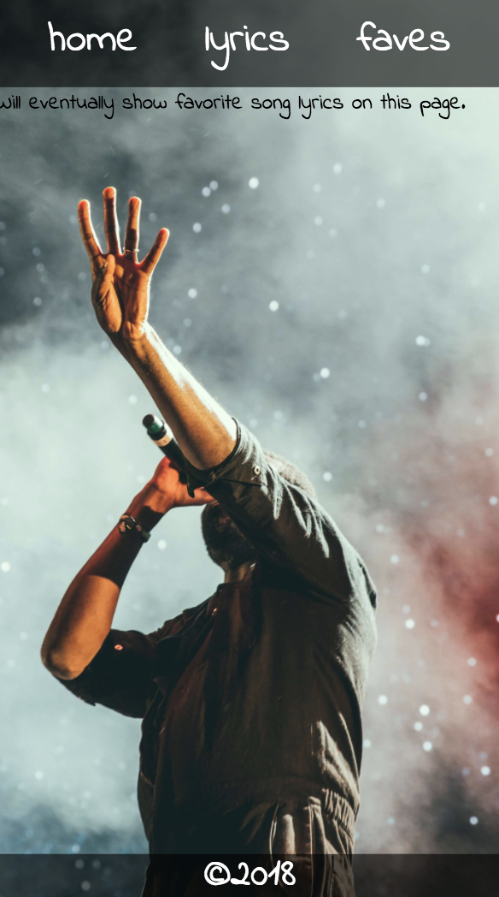
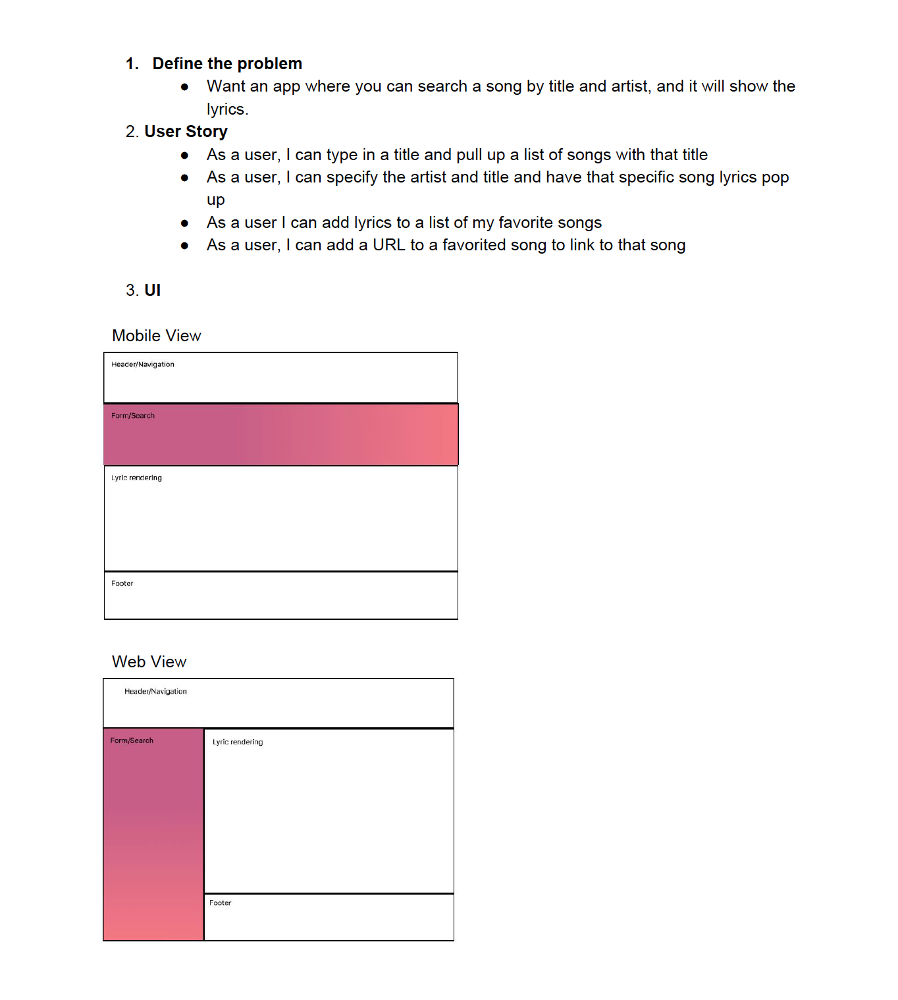

# Lyricle

Celeste Robinson

## Objective

Build a React/Redux App integrated with the MusixMatch API that displays lyrics based on user input. Allow user to favorite songs they love so they can quickly access the lyrics of those songs. Make the app completely responsive.

Unfortunately, the free tier of the API only gives the first 30% of the lyrics.

### Web Views 
##### Home Page

##### Lyrics Page

##### Faves Page


Home Page | Lyrics Page | Faves Page
--- | --- | ---
 |  | 

## Links

Live URL: https://lyricle.herokuapp.com/

GitHub Repository: https://github.com/celesterobinson/lyricle

## Technologies Used
* HTML, CSS, React, Redux + Thunk, Javascript, Axios
* Express + Middleware

## Code Examples

I used redux on this project because I needed to share information across multiple views. Redux implements a global state that allows me to do just that. A few other advantages of using Redux was readability and organization.

The below example shows my post requests. I had to first request the track which would be pushed into the the track list array. From there, I could find that track's id, create another post request with the id included, and that response would include the body of lyrics. This example demonstrates the use of a promise chain, which is a series of multiple promises inside of each other. Understanding the sequential nature of promise chains was one of the more challenging parts of this project.

```
export const getLyrics = (inputs) => {
    let {track, artist} = inputs;
    return dispatch => {
        let trackInfo = {};
        const trackUrl = `https://api.musixmatch.com/ws/1.1/track.search?q_track=${track}&q_artist=${artist}&apikey=e14650003ae32bc2229f9573c5408897`;
        axios.post("http://localhost:8080", {url: trackUrl})
            .then(response => {
                let {track_list} = response.data.message.body;
                let track = track_list[0].track;
                trackInfo.artist = track.artist_name;
                trackInfo.title = track.track_name;
                trackInfo.album = track.album_name;
                let trackId = track.track_id;
                const lyricUrl = `https://api.musixmatch.com/ws/1.1/track.lyrics.get?track_id=${trackId}&apikey=e14650003ae32bc2229f9573c5408897`;
                return axios.post("http://localhost:8080", {url: lyricUrl})
            })
            .then(response => {
                let {lyrics_body} = response.data.message.body.lyrics;
                trackInfo.lyrics = lyrics_body;
                dispatch({
                    type: "GET_TRACK",
                    track: trackInfo
                })
            }, err => {
                dispatch({
                    type: "ERR",
                    msg: "Lyrics not found :("
                })
            })
            .catch(err => {
                dispatch({
                    type: "ERR",
                    msg: "Song not found :("
                })
            })
    }
}
```

To get these requests to function, the action needed to be called the form submission. To do this, I used the {connect} method from react-redux. This allowed me to access the action from my form.

```
import { connect } from "react-redux";
import { getLyrics } from "../redux/track";
```

```
handleSubmit(e) {
    e.preventDefault();
    this.props.getLyrics(this.state.inputs);
}
```

Blamo! After importing connect, and my getLyrics action, I call the function with this.state.inputs passed in, and my request is made.

## Wireframes

## Future Ideas

I want to eventually utilize more of what the API offers. The goal is to display more track info when each song is displayed, and possibly find a way to pull up a youtube video of the song.

I would also love for users to be able to create accounts, so they can see their own favorites.

