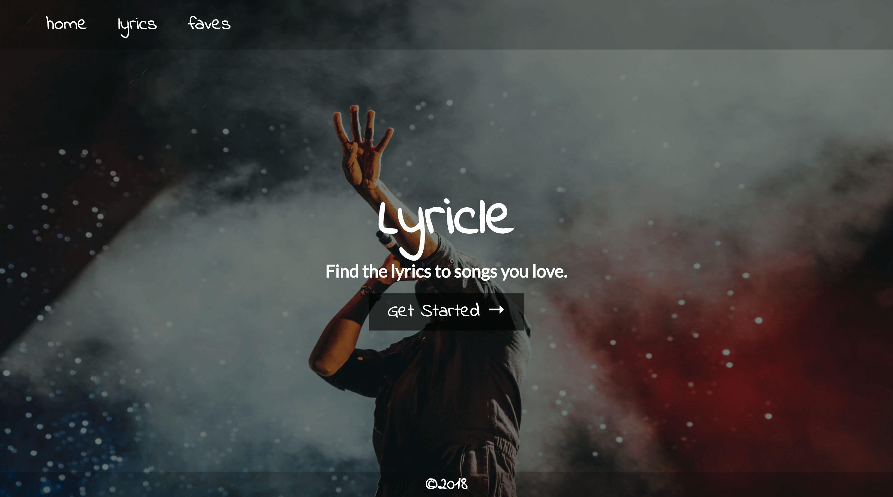
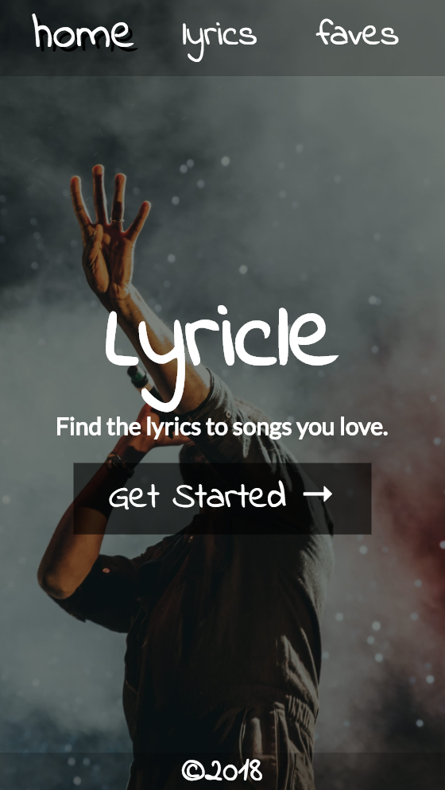
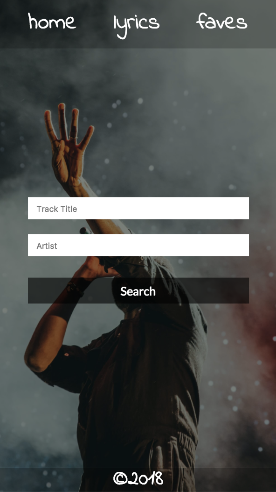

# Lyricle

Celeste Robinson

## Objective

Build a React/Redux App integrated with the MusixMatch API that displays lyrics based on user input. Allow user to favorite songs they love so they can quickly access the lyrics of those songs. Make the app completely responsive.

Unfortunately, full use of this API is very expensive. Users will only be able to see 30% of the lyrics. My long-term goal is to purchase full use.

### Home Page

#### Web Views
##### Home Page

##### Lyrics Page


### Mobile Views<br/>
Home Page<br/><br/>
Lyrics Page<br/>


## Links

Live URL: https://lyricle.herokuapp.com/

GitHub Repository: https://github.com/celesterobinson/lyricle

## Technologies Used
* HTML, CSS, React, Redux + Thunk, Javascript, Axios
* Express + Middleware

## Code Examples

Due to how small this app was, Redux wasn't really necessary. My main reason for using it was to better familiarize myself with it, and fully understand the benefits it provides to larger projects. Through its use on Lyricle, I realized that there are also benefits to using it on smaller projects. 

It was incredibly useful throughout building this app to have all of my AJAX requests in one file, separate from the other code. The readability alone made redux worth using for me.

The below example shows my post requests. I had to first request the track which would be pushed into the the track list array. From there, I could find that track's id, create another post request with the id included, and that response would include the body of lyrics.  It was my first time having to do a post inside of a post, and was difficult to wrap my mind around at first.

```
export const getLyrics = (inputs) => {
    let { track, artist } = inputs;
    return dispatch => {
        let trackInfo = {};
        const trackUrl = `https://api.musixmatch.com/ws/1.1/track.search?q_track=${track}&q_artist=${artist}&apikey=e14650003ae32bc2229f9573c5408897`;
        axios.post("http://localhost:8080", { url: trackUrl })
            .then((response) => {
                let { track_list } = response.data.message.body;
                let track = track_list[0].track;
                trackInfo.artist = track.artist_name;
                trackInfo.title = track.track_name;
                trackInfo.album = track.album_name;
                let trackId = track.track_id;
                const lyricUrl = `https://api.musixmatch.com/ws/1.1/track.lyrics.get?track_id=${trackId}&apikey=e14650003ae32bc2229f9573c5408897`;
                axios.post("http://localhost:8080", { url: lyricUrl })
                    .then((response) => {
                        let { lyrics_body } = response.data.message.body.lyrics;
                        trackInfo.lyrics = lyrics_body;
                        dispatch({
                            type: "GET_TRACK",
                            track: trackInfo
                        })
                    })
                    .catch((err) => {
                        dispatch({
                            type: "ERR",
                            msg: "Lyrics not found :("
                        })
                    })
            })
            .catch((err) => {
                dispatch({
                    type: "ERR",
                    msg: "Song not found :("
                })
            })
    }

} }
}
```

To get these request to function, the action needed to be called the form submission. To do this, I used the {connect} method from react-redux. This allowed me to access the action from my form.

